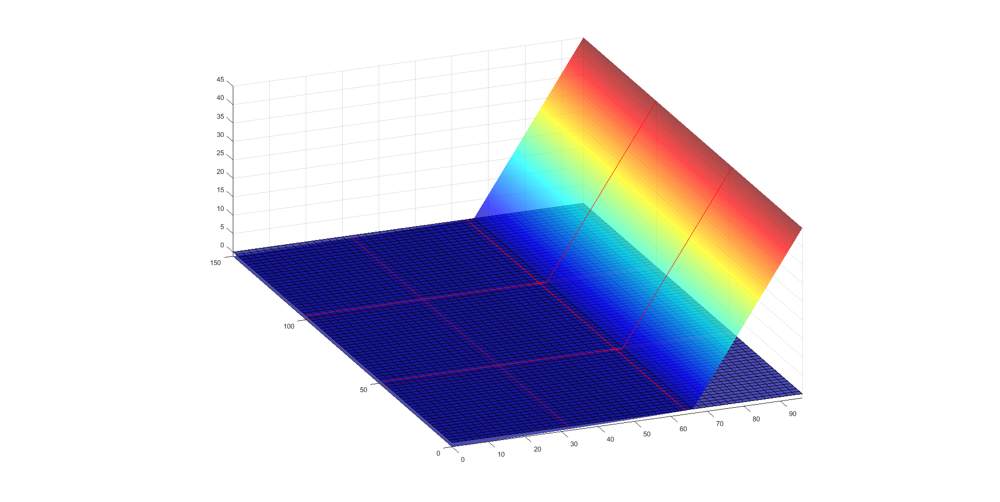
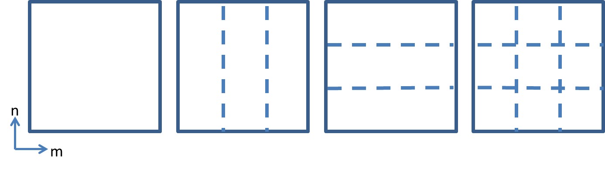

Diagnostic test for Avalanching
===============================

In this section the implementation of the general setup of scripts as explained in 'Scripts' for the testing of the module Avalanching will be explained.

Model setup
-----------

The goal is to setup a model to check whether avalanching occurs correctly, herefore it is the idea to make a 2D bathymetry with a dune that initially is too steep. 
This should make sure that the dune slides away and should initiate avalanching immediately. 
Also the avalanching mechanism is then not reliant on other parts of the code like (long) waves and the wetcell mechanism, which makes sure that you only test the working of avalanching. 
This is necessary if you want to come as close to a unit test as possible with a diagnostic test.

To make sure that the dune should slide away immediately the dune slope should be larger than the critical avalanching slope under water ('wetslp') and the critical avalanching slope above water ('dryslp'), which are 0.3 and 1.0 (-) respectively by default. 
A 30m wide dune is chosen with a slope of 1.5, giving a height of 45m. 
The rest of the profile consists of a Dean profile, with a depth of about -1.15m at the offshore boundary and 0m at the dune foot.

.. _fig-bathymetry-overview:

   
   Grid and bathymetry for the inital setup

Because the profile initially is too steep it should slide away regardless whether there are (long) waves, the modules 'swave' and 'lwave' are turned off.
Because the wave modules are turned off, parameters/files like 'instat', jonswap.txt, 'bcfile' are not specified. 
The module 'flow' is turned off as well since it is not necessary for avalanching. 
On the other hand the module 'avalanching' is of course turned on. Since this module uses 'morphology', which on its part uses 'sedtrans', both these modules are turned on as well. 
The rest of the parameters and options are not specified and are thereby the default values are used.
This holds for instance for options like 'nonh' and 'gwflow' which are turned off as default. For parameters like 'D50', 'dryslp' and 'wedslp' their default values are used.

Another important option is the choice of boundaries. 
To have as little influence of the boundaries as possible it is chosen to have wall boundaries everywhere, this type is a simple no flux boundary condition. 
This choice was later also usefull when calculating the mass balance since no mass can be transported out of the model.
Other chosen input is a constant water level of 0m (zs0=0), a maximum bed level change due to avalanching of 1 m/s/m (dzmax=1) instead of the default 0.05 to speed up the process, a NetCDF output format (outputputformat=netcdf) and a default model runtime of 600s (tstop=600), which is sufficient to contain the whole avalanching phase of the dune. 

Hereafter the used set of tests/cases/runs becomes important.
During testing of the results of a preliminary version of the diagnostic test it became clear that it was necessary to distinct the process of avalanching in multiple directions, also because the process of avalanching in x- and y-direction are coded seperately.
Herefore you have tests for the positive/negative x-direction and the positive/negative y-direction.
As a control there is a fifth test with a completely horizontal bathymetry for which no avalanching should occur.
Thereafter you have multiple cases, it turned out that some parameters needed to be tested with other values than their default as put in the P dictionary.
So apart from the standard case with those default values you have the cases: 'dzmax_0.05', 'morfac_10', 'zs0_-1', 'zs0_45'.
Per case only one parameter is changed at a time.
Therafter you have multiple runs, some problems have occured with the combination of avalanching and running with MPI so this is tested.
The runs 'benchmark' (=m1n1, 2D), 'm3n1'(2D), 'm1n3'(2D), 'm3n3'(2D), 'm1' (1D), 'm3' (1D) can be distinguished.
Hereby the two 1D runs are not for the tests with avalanching in the y-direction, XBeach 1D is automatically run in the x-direction.
The 'm' and 'n' correspond to the directions 'x' and 'y' and the numbers in how many submodels the model is devided in that direction, see the figure below:

.. _fig-MPI-setup:

   
   MPI configurations m1n1 (first), m3n1 (second), m1n3 (third) and m3n3 (fourth)
   
In the paragraphs below notable input of the specific scripts is mentioned, if it is not yet adressed above. 
All the scripts and their input can be found at https://github.com/openearth/xbeach-test-python/xbeachtest.

user_input_avalanching
----------------------

What can be noticed here are the different dictionaries based on the parameters/options/setup explained before.
To this can be added that an extra section in the script is made to make the different cases in such a way that an extra parameter value can easily be added.
Under 'CASES USER INPUT' you find the parameters that should be changed compared to dictionary P, in current setup the morfac, dzmax and zs0.
This is then made into parameter lists, so the parameters can automatically be altered in setup_avalanching.py.
Here also the different case names are created and all this info is then added to dictionary U.
The last thing is that for a case with dzmax=0.05 you need a longer runtime 'tstop', which is therefore set to 3000s for this case.

setup_avalanching
-----------------

The first part of the script makes the folder structure and varies the specific parameters as needed.
Thereafter XBeachModel from xbeach.py and Bathymetry of bathy.py are the classes used to make the bathymetry and XBeach input files.
For the bathymetry there is varied between the shapes 'flat_1d', 'flat_2d', 'dune_1d' and 'dune_2d'.
These are used to make the input for XBeachBathymetry from xbeach.py.
In here the options of 'gridextend', 'mirror' and 'turn' were created which are called for when needed.
As is common in modelling practice, there are three grid cells with equal depth at the offshore boundary.
But to avoid boundary problems at dune side the grid is extended here as well.
Thereafter XBeachModel is used to write all files into the needed folder.

analyze_this_avalanching
------------------------

After all the different XBeach models have run the results can be analysed.
First the dictionaries are loaded from the text files, after which the loops of the folder structure are used.
Then for every run the needed variables zs and zb are read from the netCDF files, just as some other parameters.
Thereafter a new for-loop is started for the checks to be performed, these are added to 'checklist'.
Within this loop all the checks asked for in dictionary C will be performed, all with a value for check as outcome (or also a massbalance for that check).
It can be seen that there are quite a number of if/elif/else statements because different tests/cases/runs require different input for the checks.

For the avalanching test there at first has been made use of the check 'bedlevelchange', to look whether there is bed level change at all.
Thereafter an important check is 'massbalance' to look if the amount of mass within the model does not change.
Then the slopes in m- and n-direction are checked, based on the appropriate locations and slopes specified in dictionary C.
Thereafter comes the mpi check in m- and/or n-direction when appropriate for the run.
At last the benchmarkcomparison in m- and/or n-direction is performed, which looks at the Root Mean Squared Error between the final bed level of the benchmark and the other corresponding runs.

(temporary) At the end of the script a plot is made for every run to visualise the initial and final bed levels along the middle transect.
With this plot many off the occurring error codes 1 can be explained.

checks
------

For the avalanching diagnostic test the checks 'bedlevelchange', 'massbalance', 'm_slope', 'n_slope', 'm_mpi', 'n_mpi' and 'rmse_comp' were created.

database
--------

The only added feature here is that the massbalance result of that check can be stored in the database.
This can be used to adress how serious the massbalance deviations are.