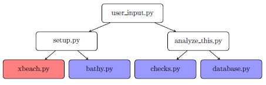

Project
=======

Introduction to XBeach
----------------------

XBeach is a state-of-the-art open-source process-based morphological model which was originally developed to simulate hydrodynamic and morphodynamic processes and impacts on sandy coasts with a domain size of kilometers and on the time scale of storms. 
Since then, the model has been applied to other types of coasts and and is continuously being developed ever since.
At Deltares, the XBeach development team regularly implements new functionalities and processes according to the latest research. 
Continuous development of a complex model like XBeach requires continuous testing. 

Testing XBeach
--------------

Currently the latest version of XBeach is tested in the Skillbed, see http://oss.deltares.nl/web/xbeach/skillbed.
Here many large models are run and their results are compared with (field)data.
For the diagnostic tests the focuss is more at testing specific modules, rather than the whole model.
The tests will be similar to integration tests, as often used in software testing, but then in a more elaborate way.
Therefore the name of diagnostic tests is chosen, with the goal of testing specific processes and functionalities of XBeach.

Structure of the diagnostic tests
---------------------------------

The structure of different diagnostic tests is initially based on vital processes of XBeach as wave, flow, sediment transport and avalanching which are each tested in a seperate diagnostic test.
Within this diagnostic tests you can have a subdivision of differenct tests/cases/runs/checks etc, see the user_input.py description for more info.

Structure of the scripts
------------------------

To realise the different diagnostic tests a structure of Python scripts is made (see Figure :numref:`fig-scripts-structure-overview`).
At first there is a user input file where all desired parameters, setting and options are specified. From here these are used in the setup and analyze_this script.
In the setup file the desired folder structures and XBeach input files are created for the different models within one diagnostic test. 
To create the desired bathymetries a seperate file called bathy.py is used, which is shared between all diagnostic tests.
To create the XBeach user input files (params.txt, jonswap.txt and grid files etc) are made using xbeach.py from https://github.com/openearth/xbeach-tools-python.
Hereafter all these different models are run on the on the H6 cluster via the TeamCity build server using generic files check_runs.py, clean_cluster.py and runall.py (see source code).

When everything is run in Xbeach the following step is to analyse the results, using the analyze_this.py.
Here every run is subjected to a series of checks to see if the results are satisfactory, performed by checks.py.
Every check gets a code 0 when the result is satisfactory, 1 when the check is run but the result is not satisfacty and 2 when the check was performed correctly.
These codes are stored in a SQL type database using the script database.py.
The checks and database files are also shared amongst the different daignostic tests.
At last the existence of a basic logfile should be mentioned.

.. _fig-scripts-structure-overview:

   Overview of the scripts with the white boxes representing scripts that are modified per diagnostic test. 
   The blue boxes represent scripts that are shared between all diagnostic tests and that can be extended if a new functionality is needed.
   And the red box represents the shared script of openearth/xbeach-tools-python/xbeachtools. 
   
For a description of the specific scripts of Figure :numref:`fig-scripts-structure-overview` see:

.. toctree::
   :maxdepth: 1
   :caption: Contents:
   
   project
   user input
   setup
   xbeach
   bathymetry
   analysis
   checks
   database

